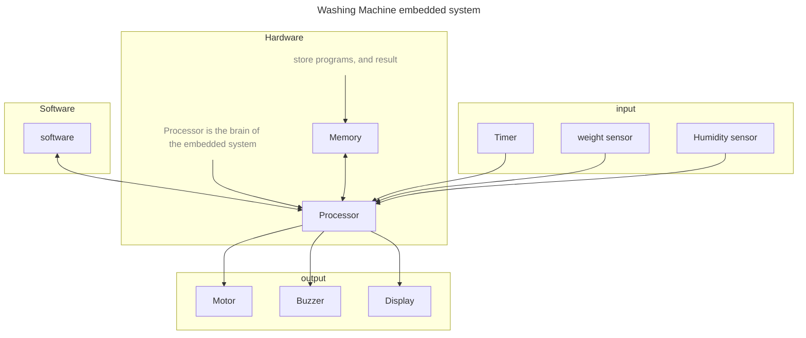

# **Embedded Software Engineer**
<sup>Develop and Test software for Embedded Device</sup>  
<sub>Prerequisite: To understand this you need to know the word of processor, programming,..etc</sub>

## **Basic Info**
Name | Details
-|-
Salary for fresher | Average 4.5LPA (2 to 15LPA)
Salary for Experience of more than 5 to 10 year | Average 8 LPA (5 to 20LPA)
Feedback | Good
Has Value? | yes


## **What they do?**
- Embedded system is the combination of both hardware and software. 
- You may consider it, as an system that executes the software instruction. 
### **To understand what they do, We need you to imagine the working of Embedded system by an example given below**
- consider the simple example washing machine, suppose you need to wash the one week of your cloths. What you do?
- you will put your cloths, detergent in washing machine, and set the timer for 30min and choose the mode for washing (heavy/soft wash)
- Then the washing machine washes and dries your cloths and inform you when its completed by sound.
- To wash you cloths, washing machine need to decide how much water is necessary, and need to perform specific task based on the mode you selected(heavy/soft). The software takes control of all the activities.
    - Software need to decide the how much of water is necessary to wash. It check the load/weight of the cloths by a specific sensor to determine the amount of water. 
        ```c
        if (weight_of_cloth>5kg)
        {
            supply water of 6liters
        }
        if(weight of cloths<4kg)
        {
            supply water of 4liters
        }
        ````
    - For Heavy Mode rotation should be fast and for the Soft Mode rotation should be slow.
        ```python
        if (Mode is "heavy")
        {
            speed of motor should be 800rmp;
        }
        if(Mode is "soft")
        {
            speed of motor should be 500rmp;
        }
        ````
    - Whether the cloth is dry or not information is required, to stop performing the drying activity. So sensor is used to get this information.
    - It should know the time to stop washing in 30min.
    - It produce the sound once it completed the washing
---


### **Difference between Embedded Software Engineer and Software Engineer**
Embedded Software Engineer | Software Engineer
-|-
They Program the microprocessor, Microcontroller using assembly language or low level language. | They write the program for thr application
In this input is taken from the sensor, and output is shown in an actuator or display | The write the program for developing application for computer or phone or web
They need a deep understanding in basic electronics components, microprocessor, oscilloscope | They need to know the various framework and development to develop the software.
Ex: Washing machine, Smart AC, smart Watch, Book theft identification system... etc | Ex: MS Office, Google, etc...

## **Basic Skill required to get into as Embedded Software Engineering**
<sup>**Note:** This skills helps you to get a placement in Embedded System role. But company may use different tool, you can learn them on the go</sup>

1. Basics of Digital and Analog Electronics
1. C
2. C++
3. Data structure and Algorithm 
1. Arduino
1. Microcontroller Programming using assembly language and C(ex: 8051)
1. Microprocessor Programming (ex: ARM)
1. Hardware test elements like oscilloscope

Topic | Course | Course Provider | Free/Paid| Recommendation| Rating
-|-|-|-|-|-


## Company details for Embedded Software Engineer role
