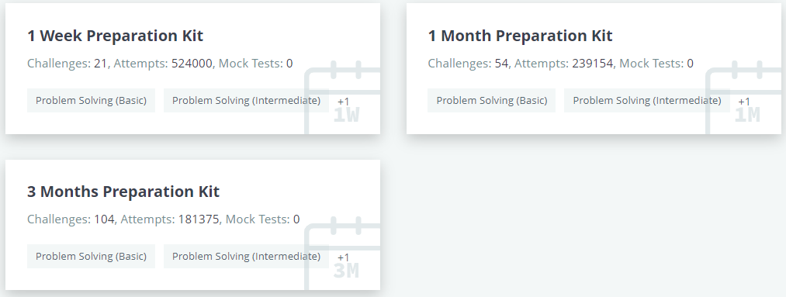

# Hackerrank
## What is hackerrank?
It is the online website to practice coding. This website user profile is recognized by the various company. If your profile has higher count of problem solving
## Use of hackerrank?
- It contains numerous amount of the programming problem to get good in Algorithms. Which is help you in the coding round in your interview process(All most all of the Interviews has the coding round).
- It has [InterviewKit](https://www.hackerrank.com/interview/preparation-kits), which helps you to get prepare for coding interview round.

- It has various preparation Topics.
## How to register?
## Solving problems
